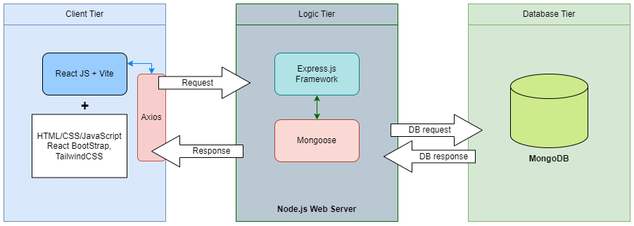

# Task Management Web Application

This project was developed for a Technical Assessment. The following readme document contains the explanation for the design and development of the application.

## Developed Features
<ul>
    <li>Create, read, and update tasks</li>
    <li>Assign assignee(s) to task from predefined entries</li>
    <li>Show assignee local time on assignment and further details once assigned to task</li>
</ul>

## System Architecture Diagram

## Tech Stack
<ul>
    <li>Frontend: React + Vite</li>
    <li>Backend: Node.js + Express.js + mongoose</li>
    <li>Database: MongoDB</li>
    <li>Language: JavaScript</li>
    <li>Styling: Tailwind CSS</li>
    <li>UI Components: React Bootstrap</li>
    <li>Other tools: Postman</li>
</ul>

## Approach and Key design decisions

The development started out by choosing the stack for implementation. Once chosen, first the backend was implemented. 

The implementation of the backend started with setting up the server and the database connection. Once established the schemas were created to create the structure of the data. Following this the routes and controllers were developed which includes, read tasks/assignees, create tasks/assignees, and update tasks. To ensure the backend was functioning before the development of the frontend, Postman was used to test the routes.

The frontend development started by establishing a connection with the backend server. Once the connection was established the base functionalities were integrated into the frontend, such as displaying the tasks and creating tasks with the help of a form. The design of the application was made deliberately simple, due to time constraints. The rest of the functionalities, updating task, assigning people, and displaying assignees on tasks were added at the end of the development, with some additional styling.

## Potential Improvements

Due to personal time constraints the final product could further be optimised/improved:

<ul>
    <li>Add React Context</li>
    <li>Add notification, to notify the user of changes/loading/errors</li>
    <li>Show the selected assignees before saving them on a task</li>
    <li>Re-design the frontend to support create a more intuitive user experience and align it with accessibility guidelines</li>
</ul>

## Hosting
<ul>
    <li>Backend: Hosted using Render free tier (might need to wait for data due to this)</li>
    <li>Frontend: Hosted using Vercel</li>
</ul>
